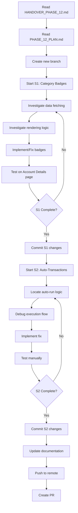

# Phase 12 - Agent Start Prompt

> **Context**: You are starting Phase 12 of the Money Flow 3 project. You have already read the [ONBOARDING.md](./ONBOARDING.md) and understand the project structure, rules, and key concepts. This prompt will guide you through starting Phase 12 work.

---

## ✅ Pre-Work Checklist

Before proceeding, confirm you have:
- [x] Read `.agent/ONBOARDING.md` (master onboarding guide)
- [x] Read `.agent/rules/rules.md` (coding standards)
- [x] Read `.agent/rules/ui_rules.md` (UI standards)
- [x] Understand the "Single Source of Truth" concept
- [x] Know where the transaction display logic lives (`unified-transaction-table.tsx`)
- [x] Dev environment is set up (`npm run dev` works)

---

## 📋 Phase 12 Overview

**Goal**: Fix two critical bugs that block core functionality.

**Priority**: HIGH - These bugs must be fixed before moving to Phase 13 enhancements.

**Estimated Time**: 4-8 hours (depending on complexity)

---

## 📖 Required Reading

### 1. **Handover Document** (MUST READ)
**File**: `.agent/HANDOVER_PHASE_12.md`

**What it contains**:
- Summary of Phase 11 work (what was just completed)
- Detailed description of the 2 bugs to fix in Phase 12
- Context on why these bugs are critical
- Handover checklist

**Action**: Read this file now to understand what was done in Phase 11 and what needs to be done in Phase 12.

### 2. **Phase 12 Implementation Plan** (MUST READ)
**File**: `.agent/PHASE_12_PLAN.md`

**What it contains**:
- Detailed investigation steps for each bug
- Potential root causes
- Proposed solutions
- Files to review and modify
- Verification plan

**Action**: Read this file to understand the technical approach for fixing the bugs.

---

## 🎯 Phase 12 Objectives

### S1: Category Badges on Account Name Column
**Problem**: Category badges are not displaying on the "Account Name" column in transaction tables.

**Tasks**:
1. Investigate if category badges are already implemented (just broken) or not implemented at all
2. Review data fetching logic to ensure category fields are being fetched
3. Review rendering logic in `unified-transaction-table.tsx`
4. Implement or fix category badge display
5. Test on Account Details page

**Success Criteria**:
- [ ] Category badges display on Account Name column
- [ ] Badges show correct category name
- [ ] Badges are styled consistently
- [ ] Layout is not broken

### S2: Auto-Transaction Creation on Services Page
**Problem**: Services configured to auto-run on Day 1 are not creating transactions automatically.

**Tasks**:
1. Locate the auto-run logic (cron job, scheduled task, or page-load trigger)
2. Check database schema for `services` table (verify `auto_run_day`, `next_run_date` fields)
3. Debug the execution flow (add logging)
4. Identify root cause (no background job, date logic bug, silent failure, etc.)
5. Implement fix
6. Test manually by triggering auto-run for a test service

**Success Criteria**:
- [ ] Transactions are created automatically on the configured day
- [ ] Transactions have correct data (amount, category, date)
- [ ] Auto-run logic is logged for debugging
- [ ] Error handling is in place

---

## 🚀 Getting Started

### Step 1: Review Phase 11 Work
**Action**: Read `.agent/HANDOVER_PHASE_12.md` to understand what was completed in Phase 11.

**Key Takeaways**:
- People Details URL bug was fixed
- Account Edit Form data loading was fixed
- Account Details Flow UI was refined (Single Flow mode)
- 36 outdated docs were archived

### Step 2: Understand Phase 12 Priorities
**Action**: Read `.agent/PHASE_12_PLAN.md` to understand the technical approach.

**Key Takeaways**:
- S1 (Category Badges) is a UI/data fetching issue
- S2 (Auto-Transactions) is likely a background job or date logic issue
- Both bugs are blocking core features

### Step 3: Create a New Branch
```bash
# Ensure you're on the latest main branch
git checkout main
git pull origin main

# Create a new branch for Phase 12 work
git checkout -b fix/phase-12-critical-bugs

# Verify you're on the new branch
git branch
```

### Step 4: Review Current Codebase State
**Action**: Familiarize yourself with the files you'll be working on.

**For S1 (Category Badges)**:
```bash
# View the transaction table component
code src/components/moneyflow/unified-transaction-table.tsx

# Check transaction service (data fetching)
code src/services/transaction.service.ts

# Check type definitions
code src/types/moneyflow.types.ts
```

**For S2 (Auto-Transactions)**:
```bash
# View the services page
code src/app/services/page.tsx

# Check service service layer
code src/services/service.service.ts

# Check service actions
code src/actions/service-actions.ts
```

### Step 5: Start with S1 (Category Badges)
**Recommended Approach**: Fix S1 first, then S2.

**Investigation Steps** (from PHASE_12_PLAN.md):
1. Check if `category_name`, `category_icon`, `category_image_url` are being fetched
2. Check if `Transaction` type includes category fields
3. Locate the "Account Name" column rendering logic
4. Determine if badges are implemented but broken, or not implemented at all

**Action**: Start investigating by searching for "account" in `unified-transaction-table.tsx`:
```bash
# Search for account column rendering
grep -n "case \"account\"" src/components/moneyflow/unified-transaction-table.tsx
```

---

## 🧪 Testing Workflow

### For S1 (Category Badges)
1. Run dev server: `npm run dev`
2. Navigate to an Account Details page (e.g., `/accounts/[id]`)
3. Verify category badges appear on the Account Name column
4. Test with different categories (Food, Transport, etc.)
5. Verify layout is not broken

### For S2 (Auto-Transactions)
1. Create a test service with `auto_run_day = 1`
2. Manually trigger the auto-run logic (or wait for Day 1)
3. Check the `transactions` table for new entries
4. Verify transaction data is correct

### General Testing
- ✅ Dev server runs without errors
- ✅ No TypeScript errors in IDE
- ✅ Manual testing confirms fixes work
- ✅ No regressions in other features

---

## 📝 Commit Guidelines

### Commit Message Format
```
<type>: <short description>

<detailed description>

<optional footer>
```

**Types**:
- `fix:` - Bug fixes
- `feat:` - New features
- `chore:` - Maintenance tasks
- `docs:` - Documentation updates
- `refactor:` - Code refactoring

**Example**:
```bash
git commit -m "fix: display category badges on Account Name column

- Add category badge rendering to Account Name cell
- Fetch category_name and category_icon in transaction query
- Style badges consistently with other badges in table

Fixes S1 of Phase 12"
```

### Commit Frequency
- Commit after completing each major step
- Don't wait until everything is done
- Use descriptive messages

---

## 🔄 Workflow Summary



---

## 📚 Reference Files

### Must Read (In Order)
1. `.agent/HANDOVER_PHASE_12.md` - What was done, what needs to be done
2. `.agent/PHASE_12_PLAN.md` - Technical approach and investigation steps

### Supporting Documentation
- `.agent/ONBOARDING.md` - Master onboarding guide
- `.agent/rules/rules.md` - Coding standards
- `.agent/rules/ui_rules.md` - UI standards
- `.agent/README.md` - Project overview

### Code References
- `src/components/moneyflow/unified-transaction-table.tsx` - Transaction display logic
- `src/services/transaction.service.ts` - Transaction data fetching
- `src/services/service.service.ts` - Service business logic
- `src/types/moneyflow.types.ts` - Type definitions

---

## 🆘 Troubleshooting

### "I can't find the category badge logic"
→ It might not be implemented yet. Check the investigation steps in `PHASE_12_PLAN.md`.

### "Build is failing with EPERM error"
→ This is a known issue with iCloud Drive. Rely on dev server and IDE TypeScript checks.

### "I don't understand the auto-run logic"
→ Read the investigation steps in `PHASE_12_PLAN.md`. It might be a cron job, scheduled task, or page-load trigger.

### "Tests are failing"
→ There are no automated tests currently. Rely on manual testing in the browser.

---

## ✅ Phase 12 Completion Checklist

Before marking Phase 12 as complete:
- [ ] S1: Category badges display correctly on Account Name column
- [ ] S2: Auto-transactions are created on the configured day
- [ ] All changes are committed with descriptive messages
- [ ] Documentation is updated (add findings to `HANDOVER_PHASE_12.md` or create new walkthrough)
- [ ] Changes are pushed to remote branch
- [ ] PR is created with detailed description
- [ ] Manual testing confirms both bugs are fixed
- [ ] No regressions in other features

---

## 🎯 Next Steps After Phase 12

Once Phase 12 is complete:
1. Read `.agent/PHASE_13_PLAN.md` for future enhancements
2. Wait for user to provide detailed requirements for Phase 13
3. Create a new handover document for Phase 13

---

## 📞 Getting Help

If you're stuck or need clarification:
1. Re-read the relevant documentation
2. Check code comments for context
3. Review git history for recent changes
4. Ask the user for clarification

---

**Good luck with Phase 12!** 🚀

Remember:
- Fix S1 first (Category Badges)
- Then fix S2 (Auto-Transactions)
- Test thoroughly
- Commit often
- Update documentation

---

**Last Updated**: 2026-02-01  
**Phase**: 12  
**Status**: Ready to Start
